# Bekrin School – Integration Audit Report

## API Contract Summary (Users Module)

| Endpoint | Method | Query/Body | Response |
|----------|--------|------------|----------|
| `/api/users/` | GET | page, page_size, role, status, search, ordering | `{ count, next, previous, results: [{ id, email, fullName, role, grade, phone, isDeleted, createdAt }] }` |
| `/api/users/` | POST | email, password, fullName, role, grade?, phone?, parentEmail?, parentPassword? | Created user object |
| `/api/users/{id}/` | PATCH | fullName?, phone?, grade? | Updated user object |
| `/api/users/{id}/soft_delete/` | POST | - | User object |
| `/api/users/{id}/restore/` | POST | - | User object |

**Permissions:** Teacher-only (IsAuthenticated + IsTeacher).

### Manual Test Checklist (Users Module)

- [ ] Login as teacher, open `/teacher/users`
- [ ] Table loads with pagination (page 1, page size 20)
- [ ] Filter by role (teacher, student, parent)
- [ ] Filter by status (active, deleted, all)
- [ ] Search by email or name (debounced)
- [ ] Click "Yeni istifadəçi" → Create modal opens
- [ ] Create teacher (email+password required)
- [ ] Create student (grade optional; credentials auto-generated if email empty)
- [ ] Create student with parent (optional parentEmail/parentPassword)
- [ ] Edit user (fullName, phone, grade)
- [ ] Soft delete student → appears in "Silinmiş" tab
- [ ] Restore student → back to "Aktiv"
- [ ] All UI text in Azerbaijani
- [ ] Error messages displayed (e.g. duplicate email)

---

## STEP 1 — INVENTORY & CONTRACT EXTRACTION

### 1.1 Frontend Audit

#### Teacher UI Modules
| Module | Page | Data Displayed | Actions | API Calls Expected |
|--------|------|----------------|---------|-------------------|
| Dashboard | /teacher | Stats: totalStudents, activeStudents, todayAttendance, codingExercisesCount | View | GET /api/teacher/stats |
| Students | /teacher/students | List (active/deleted), fullName, class, email, phone, balance | Edit, Soft delete, Hard delete | GET /api/teacher/students?status=, PATCH, DELETE |
| Groups | /teacher/groups | List with studentCount | Create, Edit, Delete, View detail (students in group) | GET/POST/PATCH/DELETE groups, GET group students |
| Attendance | /teacher/attendance | **PLACEHOLDER** – grid (monthly, daily, 4 statuses) | Mark attendance | **MISSING** |
| Payments | /teacher/payments | List with filters (group, student) | Create, Delete | GET/POST/DELETE – EXISTS |
| Bulk Import | /teacher/bulk-import | **PLACEHOLDER** | CSV import | **MISSING** |
| Coding | /teacher/coding | **PLACEHOLDER** | CRUD tasks | **MISSING** |
| Coding Monitor | /teacher/coding-monitor | **PLACEHOLDER** | Ranking, submissions | **MISSING** |
| Tests | /teacher/tests | **PLACEHOLDER** | Create quiz/exam, answer keys | **MISSING** |
| Users | /teacher/users | List (paginated), filters, create/edit/soft delete/restore | Full CRUD via /api/users/ | ✓ IMPLEMENTED |

#### Student UI Modules
| Module | Page | Data Displayed | API Calls | Status |
|--------|------|----------------|-----------|--------|
| Dashboard | /student | useMe() | GET /api/auth/me | ✓ |
| Attendance | /student/attendance | Table: date, status, groupName | GET /api/student/attendance | ✓ |
| Results | /student/results | testName, score, maxScore, date, groupName | GET /api/student/results | ✓ |
| Coding | /student/coding | Exercises with completed, score | GET /api/student/coding | ✓ |

#### Parent UI Modules
| Module | Page | Data Displayed | API Calls | Status |
|--------|------|----------------|-----------|--------|
| Dashboard | /parent | Children: attendancePercent, balance, lastTest, codingPercent | GET /api/parent/children | ✓ |
| Attendance | /parent/attendance | Per-child attendance table | GET /api/parent/attendance?studentId= | ✓ |
| Payments | /parent (modal) | Per-child payments | GET /api/parent/payments?studentId= | ✓ |
| Tests | /parent | alert placeholder | **MISSING** link to real page | Minor |

### 1.2 Backend Audit

#### Existing Endpoints
- **Auth**: POST /api/auth/login, POST /api/auth/logout, GET /api/auth/me ✓
- **Teacher**: stats, students (GET/PATCH/DELETE), groups (GET/POST/PATCH/DELETE), group students (POST/DELETE), move-student, payments (GET/POST/DELETE) ✓
- **Student**: attendance, results, coding ✓
- **Parent**: children, attendance, payments ✓

#### Models (all exist)
- accounts.User, core.Organization
- students.StudentProfile, ParentChild
- groups.Group, GroupStudent
- attendance.AttendanceRecord
- payments.Payment
- coding.CodingTask, CodingProgress, CodingSubmission
- tests.TestResult

---

## STEP 2 — GAP ANALYSIS

| Frontend Module | Backend Exists? | Action Needed |
|-----------------|-----------------|---------------|
| Teacher Dashboard stats | ✓ | None |
| Teacher Students CRUD | ✓ | Fix: StudentProfileUpdateSerializer must update User.full_name, User.phone (fullName, class/grade) |
| Teacher Groups CRUD | ✓ | Add: GET group students for detail modal |
| Teacher Attendance | ✗ | **MISSING** – Need: monthly grid data, update status endpoint |
| Teacher Payments | ✓ | None |
| Teacher Bulk Import | ✗ | **MISSING** – Need: CSV import endpoint |
| Teacher Coding tasks | ✗ | **MISSING** – Need: CRUD for CodingTask |
| Teacher Coding Monitor | ✗ | **MISSING** – Need: ranking + submissions list |
| Teacher Tests | ✗ | **MISSING** – Need: CRUD for tests, answer keys |
| Teacher Users | ✗ | **MISSING** – Need: list/create users (optional for Phase 1) |
| Student Dashboard | ✓ | None |
| Student Attendance | ✓ | None |
| Student Results | ✓ | None |
| Student Coding | ✓ | None |
| Parent Dashboard | ✓ | None |
| Parent Attendance | ✓ | None |
| Parent Payments | ✓ | None |

### Priority Fixes (minimal for working integration)
1. **Student update** – fullName/phone on User (serializer fix)
2. **Group students** – endpoint for group detail modal
3. **Teacher Attendance** – core feature: grid + update
4. **Teacher Coding** – list + basic CRUD
5. **Teacher Coding Monitor** – ranking + submissions
6. **Teacher Tests** – list + basic CRUD (if TestResult model supports)
7. **Bulk Import** – CSV endpoint
8. **Localization** – "Bulk Import" → "Toplu İdxal" ✓

---

## STEP 8 — FINAL OUTPUT

### A) Integration Report – Implemented Fixes

#### Backend Changes
| Item | Description |
|------|-------------|
| StudentProfileUpdateSerializer | Now updates User.full_name, User.phone; accepts `class` → grade |
| GET /api/teacher/groups/{id}/students | Lists students in group for detail modal |
| GET /api/teacher/attendance?year=&month= | Monthly attendance grid (groups, students, dates, status) |
| POST /api/teacher/attendance/update | Create/update attendance record |
| GET/POST /api/teacher/coding | List/create coding tasks |
| GET/PATCH/DELETE /api/teacher/coding/{id} | Coding task CRUD |
| GET /api/teacher/coding-monitor | Ranking + submissions list |
| GET/POST /api/teacher/tests | List/create tests |
| POST /api/teacher/test-results | Manual grade entry |
| POST /api/teacher/bulk-import | CSV student import |
| GET /api/student/stats | Missed count + attendance % |
| GET /api/parent/test-results?studentId= | Parent view of child test results |

#### Frontend Changes
| Page | Change |
|------|--------|
| Teacher Attendance | Full grid with month nav, status dropdowns, real API |
| Teacher Groups | Group detail modal: list students, add/remove |
| Teacher Coding | CRUD for coding tasks |
| Teacher Coding Monitor | Ranking table + submissions table |
| Teacher Tests | Create test, add result; list both |
| Teacher Bulk Import | CSV upload, default password, result feedback |
| Student Dashboard | Stats cards (missed count, attendance %) |
| Parent Dashboard | Tests modal with child results |

#### Localization
- "Bulk Import" → "Toplu İdxal"
- Menu card description updated
- Hesabatlar quick action links to dashboard (reports not yet implemented)

### B) Remaining TODOs
- **Teacher Reports** – Analytics/reports page (future)
- **Test anti-cheat** – Future enhancement per schema

### C) Integration Gaps Found (Updated)

| Module | Where | Issue | Fix Applied |
|--------|-------|-------|-------------|
| Users | /teacher/users | Was placeholder | Implemented full table, filters (role, status), debounced search, pagination, create/edit modal, soft delete/restore dialogs, Azerbaijani UI |
| Users API | config/urls.py | No routes for /api/users/ | Added path('api/users/', include('accounts.urls_users')) |
| Users API | accounts/ | No views | Created accounts/views/users.py + accounts/urls_users.py |

### D) ERD (Mermaid)

```mermaid
erDiagram
    Organization ||--o{ User : has
    Organization ||--o{ Group : has
    Organization ||--o{ Payment : has
    Organization ||--o{ AttendanceRecord : has
    Organization ||--o{ CodingTask : has
    Organization ||--o{ CodingSubmission : has
    Organization ||--o{ Test : has

    User ||--o| StudentProfile : "student"
    User ||--o| ParentProfile : "parent"
    User ||--o| TeacherProfile : "teacher"

    User ||--o{ ParentChild : "parent"
    User ||--o{ ParentChild : "student"

    Group ||--o{ GroupStudent : has
    StudentProfile ||--o{ GroupStudent : member

    StudentProfile ||--o{ AttendanceRecord : has
    Group ||--o| AttendanceRecord : "group context"
    User ||--o| AttendanceRecord : "marked_by"

    StudentProfile ||--o{ Payment : has
    Group ||--o| Payment : optional
    User ||--o| Payment : "created_by"

    CodingTask ||--o{ CodingTestCase : has
    User ||--o{ CodingTask : "created_by"
    CodingTask ||--o{ CodingSubmission : has
    User ||--o{ CodingSubmission : "student"
    CodingTask ||--o{ CodingProgress : has
    StudentProfile ||--o{ CodingProgress : has

    Test ||--o| TestAnswerKey : has
    User ||--o{ Test : "created_by"
    Test ||--o{ TestAssignment : has
    Test ||--o{ TestAttempt : has
    User ||--o{ TestAttempt : "student"
    StudentProfile ||--o{ TestResult : has
    Group ||--o| TestResult : optional

    User {
        int id PK
        string email UK
        string full_name
        string role "teacher|student|parent"
        string phone
        int organization_id FK
    }

    StudentProfile {
        int id PK
        int user_id FK "OneToOne"
        string grade
        decimal balance
        datetime deleted_at
    }

    ParentChild {
        int parent_id FK
        int student_id FK
        datetime created_at
    }

    Group {
        int id PK
        string name
        json days_of_week
        time start_time
        int teacher_id FK
    }

    GroupStudent {
        int group_id FK
        int student_profile_id FK
        datetime joined_at
        datetime left_at
    }

    AttendanceRecord {
        int student_profile_id FK
        date lesson_date
        string status "present|absent|late|excused"
        int group_id FK "optional"
        int marked_by_id FK
    }

    Payment {
        int student_profile_id FK
        int group_id FK "optional"
        date payment_date
        decimal amount
        string method "cash|card|bank"
    }

    CodingTask {
        int id PK
        string title
        text description
        string difficulty
    }

    CodingTestCase {
        int task_id FK
        text input_data
        text expected
    }

    CodingSubmission {
        int task_id FK
        int student_id FK
        text submitted_code
        string status
    }

    Test {
        int id PK
        string type "quiz|exam"
        string title
        string pdf_url
    }

    TestAnswerKey {
        int test_id FK "OneToOne"
        json mcq_answers
        json numeric_answers
    }
```



### E) How to Verify Locally (Windows PowerShell)

```powershell
# 1. PostgreSQL - ensure service is running
# Check: Get-Service postgresql* (or your Postgres service name)
# Start if needed: Start-Service postgresql-x64-16  (adjust version)

# 2. Verify DB connection via psql
psql -U postgres -d bekrin -c "SELECT version();"

# 3. Verify tables exist
psql -U postgres -d bekrin -c "\dt"

# 4. Django backend - verify uses PostgreSQL
cd bekrin-back
.venv\Scripts\activate
$env:PYTHONIOENCODING="utf-8"
python manage.py check
python manage.py dbshell  # Should open psql for DATABASES["default"]

# 5. Run migrations
python manage.py migrate

# 6. Start backend
python manage.py runserver

# 7. In another terminal - Frontend
cd bekrin-front
npm run dev

# 8. Smoke test endpoints (with valid token)
# GET /api/users/ - Users list
# POST /api/users/ - Create user
# PATCH /api/users/{id}/ - Update user
# POST /api/users/{id}/soft_delete/ - Soft delete
# POST /api/users/{id}/restore/ - Restore
```

### F) No Data Loss Statement

- No destructive commands (DROP DATABASE, flush, reset) were run.
- No existing migrations, models, or working code were deleted.
- Changes were additive: new Users API (`accounts/views/users.py`, `accounts/urls_users.py`), new frontend Users page, new `lib/users.ts`.
- Soft delete uses `StudentProfile.deleted_at`; no cascade deletes on user restore.
- All relationships preserved; ParentChild unique_together, GroupStudent unique_together, AttendanceRecord unique_together unchanged.
